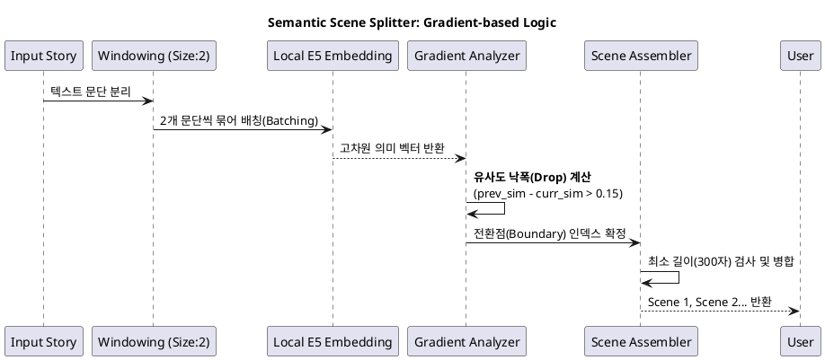

# 📖 Semantic Scene Splitter: 아키텍처

## 1. 개요 (Overview)
본 모듈은 한국어 웹소설의 빠른 호흡과 빈번한 시공간 전환을 정교하게 포착하기 위해 설계된 **임베딩 기반 장면 분할(Scene Segmentation)** 엔진입니다.

단순히 특정 키워드(If-else)에 의존하지 않고, 문맥의 흐름이 급격히 변하는 **'의미적 절벽(Semantic Cliff)'**을 수학적으로 탐지합니다.

## 2. 기술 스택 (Tech Stack)
* **Core Model:** `intfloat/multilingual-e5-base` (via Sentence-Transformers, `EMBEDDING_MODEL`)
* **Strategy:** Sliding Window + Gradient Drop Detection
* **Environment:** Local Embedding Server

---

## 3. 시스템 아키텍처 (PlantUML)

---

## 4. 핵심 설계 포인트 (Key Design Points)

### ✅ 모델 특성·유사도 스케일
* **이전(MiniLM):** 문장 간 코사인 유사도가 전반적으로 높게(대략 0.7~0.9대) 나오는 경향이 있어, 절대 임계값보다 **이전 스텝 대비 유사도 낙폭(`drop_threshold`, 기본 0.15)** 으로 경계를 잡는 방식이 잘 맞았습니다.
* **현재(E5-base):** 임베딩 분포가 모델마다 다릅니다. 동일한 상대 낙폭 로직은 유지하되, 분할이 과하거나 부족하면 `scene_chunker.split_into_scenes(..., drop_threshold=...)` 를 조정하세요.

### ✅ 비대칭 윈도우 최적화 (`window_size = 2`)
* 웹소설은 한두 문단 사이에 현재에서 과거(회상)로 급격히 전환됩니다.
* 윈도우가 크면(예: 4~5) 전후 맥락이 섞여 변화가 희석되므로, 윈도우를 최소화하여 **맥락의 교차점**을 날카롭게 포착합니다.

### ✅ 규칙 배제 (Rule-free Logic)
* "그때였다", "한편" 같은 지엽적인 키워드 필터 없이 오직 **데이터(Vector)**의 변화만 믿습니다. 이는 작가의 문체나 장르가 바뀌어도 로직 수정 없이 대응 가능한 범용성을 제공합니다.

---

## 5. 케이스 스터디 (Case Study: 성공 사례)

**[Input 데이터 상황]**
1. **Scene A:** 아카데미 접수처에서 쫓겨나며 절규하는 주인공 (현재)
2. **Transition:** "주마등처럼 그 기구했던 세월이... 차오르기 시작했다."
3. **Scene B:** "나가! 우리 가문에..." 아버지에게 쫓겨나던 과거 (회상)

**[알고리즘 작동 결과]**
* **임베딩 분석:** '쫓겨남'이라는 공통 키워드에도 불구하고, 배경이 '아카데미'에서 '백작저'로 바뀌는 순간 **벡터의 방향성(Cosine Similarity)이 급격히 변화**함.
* **결과:** 지엽적 규칙 없이도 2개의 독립된 Scene으로 정확히 분리 성공.

---

## 6. 향후 개선 방향
* **Adaptive Threshold:** 소설 전체의 유사도 평균을 계산하여 `drop_threshold`를 자동 조절하는 통계적 기능 검토.
* **Model Upgrade:** 더 높은 품질·비용이 필요하면 `intfloat/multilingual-e5-large` 등으로 교체 검토 (벡터 차원·DB 재임베딩·threshold 재튜닝 필요).
